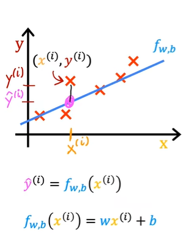
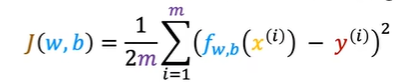
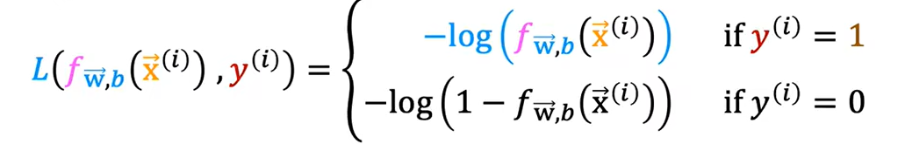

# 机器学习学习笔记

## 1. 引言
机器学习（Machine Learning, ML）是人工智能（AI）领域的重要分支，旨在通过数据让计算机自主学习并做出决策。2. 机器学习的基本概念

### 2.1 机器学习定义
机器学习是一种通过构建数学模型，使计算机能够自动分析数据并做出预测或决策的技术。它的核心是通过训练过程，让模型从历史数据中发现模式和规律，从而在新数据上进行推断。

### 2.2 监督学习与无监督学习
- **监督学习**：
  - **数据特点**：有标签的数据集，即每个样本都有已知的输出。
  - **任务**：建立一个输入和输出之间的映射关系。
  - **常见任务**：分类——预测连续值输出（如垃圾邮件检测）、回归——预测离散值输出（如房价预测）。
- **无监督学习**：
  - **数据特点**：无标签的数据集，即数据没有已知的输出。
  - **任务**：从数据中发现隐藏的模式和关系。
  - **常见任务**：聚类（如客户分群）、降维（如数据可视化）。

### 2.3 机器学习与深度学习的区别
- **机器学习**：
  - **定义**：机器学习是广泛的领域，涵盖从线性回归到神经网络的各种方法，注重从数据中自动学习并做出决策。
  - **特点**：通常需要进行特征工程，手动提取重要特征。
  - **应用场景**：适用于较简单和中等复杂度的问题。
- **深度学习**：
  - **定义**：深度学习是机器学习的一个子集，依赖于神经网络（特别是多层神经网络），用于自动提取和学习数据的特征。
  - **特点**：深度学习依赖于大型神经网络结构，可以自动进行特征提取。
  - **应用场景**：适合图像、语音、文本等复杂的高维数据处理。

### 2.4 变量解释

| 变量名         | 含义                         |
| -------------- | ---------------------------- |
| m              | 训练样本的数量               |
| n              | 特征数量                     |
| x              | 输入变量/特征                |
| y              | 输出变量/目标变量            |
| (x, y)         | 一个训练样本                 |
| (x^(i), y^(i)) | 第i个训练样本                |
| x_j^(i)        | 第j个特征的第i个训练样本的值 |
| w              | 特征对应的权重               |
| b              | 偏置                         |

## 3. 机器学习中的常见模型

### 3.1 线性回归

#### 3.1.1 介绍

线性回归是一种用于解决**回归问题**的算法，它通过拟合一个线性方程来预测目标变量。目标变量是连续的，线性回归的目标是找到输入特征与输出目标之间的线性关系。

#### 3.1.2 代价函数

### 3.2 逻辑回归

#### 3.2.1 介绍

逻辑回归是一种用于解决**分类问题**的算法，尤其是二分类问题。尽管名字中有“回归”，逻辑回归实际上是用来预测事件发生的概率。

#### 3.2.2 损失函数

### 3.3 决策树

决策树是一种常用的机器学习算法，适用于分类和回归任务。它通过一系列的决策规则将数据划分成不同的类别或预测值。

决策树由节点、边和叶子节点组成。每个内部节点表示一个特征的测试，每条边表示测试的结果，叶子节点表示最终的输出（类别或值）决策树的决策过程易于理解和解释，可以直观地展示决策规则，适合于需要透明性和可解释性的应用场景决策树能够处理缺失值，且对数据的分布没有严格的假设要求。

## 4. 机器学习中数学

### 4.1 偏导数

**偏导数**用于描述多变量函数相对于其中一个变量的变化率。在机器学习中，尤其是反向传播算法中，偏导数用于计算损失函数对每个权重的影响，从而帮助优化参数。

### 4.2 链式法则
**链式法则**是求复合函数的导数的关键方法。在神经网络中，反向传播算法依赖于链式法则来计算损失函数对网络各层参数的梯度，以便在多层神经网络中有效地传播误差。

### 4.3 梯度
**梯度**是导数在多维空间中的推广，它指向函数最大变化的方向。在机器学习中，**梯度下降法**用于最小化损失函数，模型通过沿着损失函数梯度下降的方向更新权重，从而逐渐逼近全局或局部最优解。

### 4.4 矩阵
**矩阵**是处理高维数据和运算的基础。机器学习中的大部分操作，例如输入数据和权重的乘积，都是以矩阵形式进行。矩阵运算的高效性是深度学习在现代计算机中得以实现的重要原因，特别是在利用GPU的并行计算时。

---

## 5. 机器学习中的神经网络 

组成   代价函数 前反向传播 

### 5.1 组成
**神经网络**模拟人脑的结构，由多个神经元（节点）组成。每个**神经元**接受输入信号，进行加权和计算，最后通过**激活函数**输出。神经元的集合构成**神经层**，常见的结构包括：
- **输入层**：接收原始输入数据。
- **隐藏层**：包含若干中间层，用于从输入数据中提取复杂特征。
- **输出层**：产生最终预测结果。

### 5.2 代价函数

代价函数（Cost Function），也称为损失函数（Loss Function），是在机器学习和统计建模中用于评估模型预测与真实结果之间差异的函数。

- **均方误差（MSE, Mean Squared Error）**：
  - 适用于回归任务，计算预测值与真实值之间的平方差的平均值。
  - 公式：\[ \text{MSE} = \frac{1}{n} \sum_{i=1}^{n} (y_i - \hat{y}_i)^2 \]

- **均方根误差（RMSE, Root Mean Squared Error）**：
  - 是 MSE 的平方根，提供了与原始数据单位相同的误差度量。
  - 公式：\[ \text{RMSE} = \sqrt{\text{MSE}} \]

- **绝对误差（MAE, Mean Absolute Error）**：
  - 计算预测值与真实值之间绝对差的平均值。
  - 公式：\[ \text{MAE} = \frac{1}{n} \sum_{i=1}^{n} |y_i - \hat{y}_i| \]

- **交叉熵（Cross-Entropy）**：
  - 常用于分类任务，衡量预测概率分布与真实分布之间的差异。
  - 对于二分类，公式为：\[ \text{Cross-Entropy} = -\frac{1}{n} \sum_{i=1}^{n} [y_i \log(\hat{y}_i) + (1 - y_i) \log(1 - \hat{y}_i)] \]

### 5.3 前向传播与反向传播
- **前向传播**：输入数据依次经过每一层，生成输出。
- **反向传播**：计算每个参数对损失的偏导数，并用梯度下降法来更新权重，从而优化模型。

### 5.4 常见的激活函数
1. **ReLU (Rectified Linear Unit)**:
   - 定义：\( f(x) = \max(0, x) \)
   - 特点：计算简单，收敛速度快，但可能导致“死神经元”问题（即某些神经元永远不激活）。

2. **Sigmoid**:
   - 定义：\( f(x) = \frac{1}{1 + e^{-x}} \)
   - 特点：输出范围在 (0, 1) 之间，适用于二分类问题。但在深度网络中容易导致梯度消失。

3. **Tanh (双曲正切)**:
   - 定义：\( f(x) = \tanh(x) = \frac{e^x - e^{-x}}{e^x + e^{-x}} \)
   - 特点：输出范围在 (-1, 1) 之间，比 sigmoid 更加中心化，减轻了梯度消失问题。

4. **Leaky ReLU**:
   - 定义：\( f(x) = \max(0.01x, x) \)
   - 特点：对负值有轻微的线性响应，减轻了“死神经元”问题。

5. **Softmax**:
   - 定义：\( f(x_i) = \frac{e^{x_i}}{\sum_j e^{x_j}} \)
   - 特点：将输出转换为概率分布，常用于多分类问题的输出层。

6. **ELU (Exponential Linear Unit)**:
   - 定义：\( f(x) = x \) if \( x > 0 \) else \( \alpha (e^x - 1) \)
   - 特点：对负值进行平滑处理，能够缓解梯度消失问题，并且能够保持均值接近 0。

7. **Swish**:
   - 定义：\( f(x) = x \cdot \text{sigmoid}(x) \)
   - 特点：连续且可导，通常在深度学习中效果较好。

---

## 6. 机器学习中的数据处理

### 6.1 数据清洗
在训练机器学习模型之前，必须对数据进行清洗。这包括：
- **处理缺失值**：填充缺失值或删除有缺失值的数据点。
- **去除异常值**：检测和去除明显偏离正常范围的数据点。

### 6.2 特征工程
**特征工程**是指从原始数据中提取有意义的特征，用于提高模型性能。包括以下几步：
1. **特征选择**：选择对任务最有帮助的特征，去掉无关或冗余特征。
2. **特征缩放**：对特征进行归一化或标准化，使得特征在相同尺度上，常用的方法包括**Min-Max缩放**和**Z-score标准化**。

### 6.3 数据集划分
将数据集划分为训练集、验证集和测试集，以评估模型的泛化能力：
- **训练集**：用于训练模型。
- **验证集**：用于调参，帮助选择最优的超参数。
- **测试集**：用于最终评估模型性能。

### 6.4 数据增强
对于某些数据类型（如图像），**数据增强**（Data Augmentation）是一种扩展数据集的方法，可以通过图像旋转、翻转、缩放等手段，增加训练样本的多样性，从而提升模型的鲁棒性。

