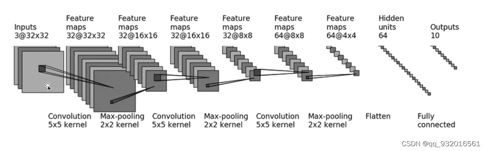
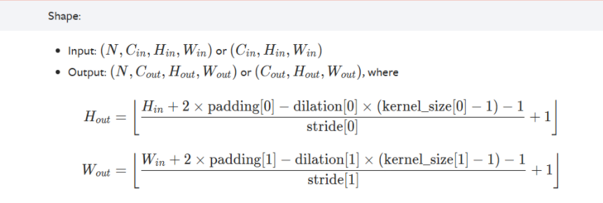
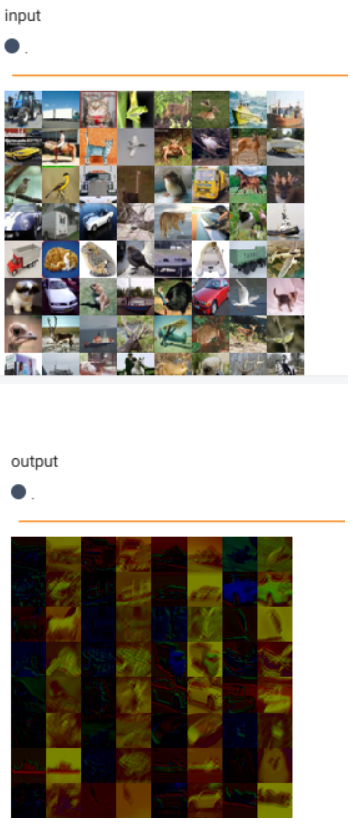
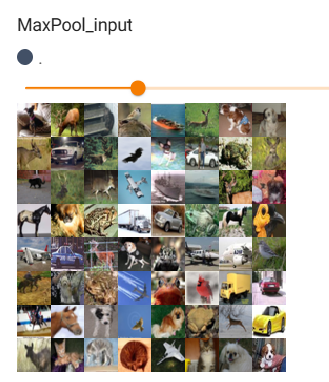
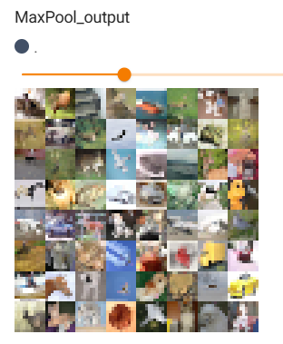
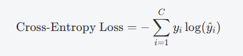
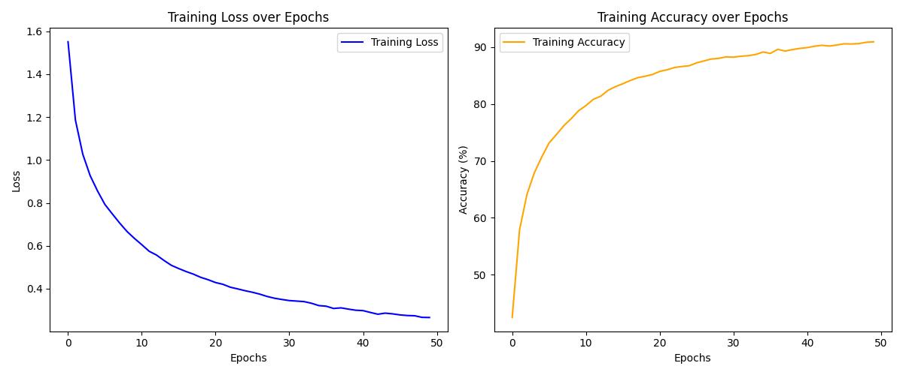

# task2

## 数据的加载和预处理

### 1.1 数据集的下载

分为训练数据集和测试数据集

```python
trainset = torchvision.datasets.CIFAR10(root='dataset', train=True, download=True, transform=transform)
```

```python
testset = torchvision.datasets.CIFAR10(root='dataset', train=False, download=True, transform=transform)
```

`root`->数据集存放的目录

`train`->选择返回的是训练图像集（True）还是测试图像集（False）

`download`->是否下载

`transform`->对图像进行预处理的方式

### 1.2 数据集的加载

用到了`dataloader`进行数据集加载，可以让数据分批次进行处理，并支持多线程加载，以提高数据处理速度。

```python
trainloader = DataLoader(trainset, batch_size=batch_size, shuffle=True)
```

第一个参数是要加载的数据集

`batch_size`->每一批包含的样本数

`shuffle`->在每个epoch开始前是否打乱数据顺序


## 2.  构建模型

阅读框架，发现这道题用到的数据集是CIFAR10，经过搜索，知道这是个10个分类的图像集。题目要求使用torch的框架，于是我开始跟着网上的教程搭建起了第一个模型



这是一个经过三次卷积和最大池化交替，然后展平，最后经过两次全连接层的网络模型

拆开来看：

- 卷积

  卷积是用于提取图像特征的一个重要工具，它通过一个卷积核在图像上滑动，做点积运算，最后生成特征图

  

  在构建模型时，我们使用`nn.Conv2d`进行卷积操作

  它拥有以下几个常用的参数

  ```py
  nn.Conv2d(in_channels, out_channels, kernel_size, stride, padding)
  ```

  其中

  `in_channels`->输入数据的通道数

  `out_channels`->通过卷积输出的通道数

  `kernel_size`->卷积核的尺寸

  `stride`->卷积核移动的步幅，默认是1

  `padding`->在输入数据的边缘添加的0填充，默认是0

遇到的问题是，模型图中在每次的卷积只显示了输入通道数，输出通道数，卷积核大小和图形尺寸，没有其他的参数。

于是我在torch网站，找到`Conv2d`的参数计算公式，不是空洞卷积，所以`dilation`为1，`stride`默认值为卷积核大小，于是计算出`padding`=2，而不是默认值0



经过卷积操作前后的图像对比：




- 池化

  用于降低特征图的尺寸，减少计算量，同时保留重要的特征信息，以最大池化为例：

  ```py
  nn.MaxPool2d(kernel_size, stride, ceil_mode)
  ```

  `kernel_size`->池化窗口的大小

  `stride`->窗口移动的步长，默认值是`kernel_size`

  `ceil_mode`->当设置为True时，如果池化窗口超出图片时，依然会保留当中的最大值

  经过最大池化前后的图像对比：

  

  

- 展平

  将多维的特征图转化为一维向量，使后续能进行全连接层的计算，在卷积层和全连接层中起桥梁的作用

- 全连接层和非线性激活

  全连接层接受来自前一层的输入，然后执行线性变换，之后在全连接层之间加入非线性激活函数，将提取的特征进行整合和处理，最后映射到我们要分类的10个类别中。

于是我们可以写出以下的网络结构：

```python
class Network(nn.Module):
    def __init__(self):
        super(Network, self).__init__()
        self.model = Sequential(
            Conv2d(3, 32, 5, padding=2),
            MaxPool2d(2),
            
            Conv2d(32, 32, 5, padding=2),
            MaxPool2d(2),
            
            Conv2d(32, 64, 5, padding=2),
            MaxPool2d(2),
            
            Flatten(),
            Linear(1024, 64),
            ReLU()
            Linear(64, 10)
        )

    def forward(self, x):
        x = self.model(x)
        return x
```

## 损失函数和优化器

面对多分类问题，我们常常会选择交叉熵损失函数：



其中C表示有几个类别

在优化器的选择上，有两个常用的优化器：SGD优化器和Adam优化器

刚开始选择的是SGD优化器：

```bash
Epoch [1/10], Loss: 2.3016, Accuracy: 10.02%
Epoch [2/10], Loss: 2.2968, Accuracy: 11.91%
Epoch [3/10], Loss: 2.2911, Accuracy: 14.71%
Epoch [4/10], Loss: 2.2823, Accuracy: 14.17%
Epoch [5/10], Loss: 2.2671, Accuracy: 14.00%
Epoch [6/10], Loss: 2.2381, Accuracy: 15.63%
Epoch [7/10], Loss: 2.1927, Accuracy: 18.40%
Epoch [8/10], Loss: 2.1569, Accuracy: 19.71%
Epoch [9/10], Loss: 2.1342, Accuracy: 21.40%
Epoch [10/10], Loss: 2.1094, Accuracy: 23.22%

Accuracy of the model on the 10000 test images: 24.45%
```

之后尝试使用Adam优化器的运行结果：

```bash
Epoch [1/10], Loss: 1.4785, Accuracy: 46.55%
Epoch [2/10], Loss: 1.0874, Accuracy: 61.68%
Epoch [3/10], Loss: 0.9314, Accuracy: 67.36%
Epoch [4/10], Loss: 0.8131, Accuracy: 71.74%
Epoch [5/10], Loss: 0.7273, Accuracy: 74.35%
Epoch [6/10], Loss: 0.6472, Accuracy: 77.30%
Epoch [7/10], Loss: 0.5795, Accuracy: 79.62%
Epoch [8/10], Loss: 0.5150, Accuracy: 81.99%
Epoch [9/10], Loss: 0.4611, Accuracy: 83.58%
Epoch [10/10], Loss: 0.4073, Accuracy: 85.54%

Accuracy of the model on the 10000 test images: 68.03%
```

在10轮的训练下，使用两种优化器的结果为何差异会如此之大。

通过搜索，得知了Adam 通常收敛更快，通过自适应调整学习率，能在初期阶段迅速接近最优解，适合大多数深度学习应用。而如果在大规模数据集上进行长时间训练，并希望模型能够具有更强的泛化能力，可以使用 SGD。

因此在10轮的小规模数据集的训练，这里使用Adam优化器是比较合适的。

### 模型优化

通过上面的图可以观察到，模型在训练集上的正确率可以达到85但是最终在测试集上只有68，这说明模型的泛化能力不够强，存在过拟合的问题。

为了解决过拟合问题，我尝试采取以下解决方式

- 在全连接层增加一层Dropout，随机“丢弃”一部分神经元，减少模型对特定神经元的依赖。


- 采用BatchNorm2d方法，对数据进行拟归一化，可以起到标准的作用，加速训练，减少过拟合的风险


最终神经网络可以写成：

```python
self.model = Sequential(
            Conv2d(3, 32, 5, padding=2),
        	BatchNorm2d(32),
            ReLU(),
            MaxPool2d(2),

            Conv2d(32, 32, 5, padding=2),
        	BatchNorm2d(32),
            ReLU(),
            MaxPool2d(2),

            Conv2d(32, 64, 5, padding=2),
        	BatchNorm2d(64),
            ReLU(),
            MaxPool2d(2),

            Flatten(),
            Linear(64 * 4 * 4, 64),
            ReLU(),
            Dropout(0.5),
            Linear(64, 10)
        )
```

测试结果：

```bash
Epoch [1/10], Loss: 1.6066, Accuracy: 40.88%
Epoch [2/10], Loss: 1.3036, Accuracy: 52.61%
Epoch [3/10], Loss: 1.1689, Accuracy: 58.16%
Epoch [4/10], Loss: 1.0748, Accuracy: 62.05%
Epoch [5/10], Loss: 1.0046, Accuracy: 64.36%
Epoch [6/10], Loss: 0.9513, Accuracy: 66.49%
Epoch [7/10], Loss: 0.9021, Accuracy: 68.21%
Epoch [8/10], Loss: 0.8576, Accuracy: 69.81%
Epoch [9/10], Loss: 0.8265, Accuracy: 70.77%
Epoch [10/10], Loss: 0.7966, Accuracy: 71.81%

Accuracy of the model on the 10000 test images: 75.25%
```

虽然在训练集上的准确率较先前下降了，但是在测试集上的准确率有了明显提升，最终准确率来到了75

## 3. 进阶部分

目前的处理方式在测试集上达到了75的准确率，目标是进一步提高。那么，通过查阅资料，我打算从以下几部分改进我的代码

### 数据预处理

目前对数据集所做的预处理只有将图片转化成tensor类型，于是考虑对数据进行更多的增强，使模型能见到更多样的数据，如随机翻转，随机裁剪等，以此来提高模型的泛化能力。

同时，在数据的预处理中，对图像每个通道进行归一化（Normalize），可以帮助模型更快地学习，提高稳定性。

```python
train_transform = transforms.Compose([
    transforms.RandomHorizontalFlip(),
    transforms.RandomCrop(32, padding=4),
    transforms.ToTensor(),
    transforms.Normalize((0.4914, 0.4822, 0.4465), (0.247, 0.2435, 0.2616))
])
```

其中，Normalize的两个参数：mean（均值）、std（标准差），通过遍历整数据集的图像，并对每个通道的所有像素进行统计计算。

```py
mean = 0.0
std = 0.0
num_samples = 0

for data in trainset:
    image, _ = data
    # 计算每张图片的总像素数
    num_samples += image.size(1) * image.size(2)
    # 对每个通道累加
    mean += image.sum((1, 2))
    std += (image ** 2).sum((1, 2))

# 计算全局均值
mean /= num_samples
# 计算全局标准差
std = torch.sqrt(std / num_samples - mean ** 2)

print("Mean:", mean)
print("Std:", std)
```

得到结果：

```py
Mean: tensor([0.4914, 0.4822, 0.4465])
Std: tensor([0.2470, 0.2435, 0.2616])
```

*（测试集并不需要进行数据增强，所以测试集的预处理只有转化成tensor和归一化）*

### 训练轮数

增加训练的轮数至50次，使模型更充分地学习特征

### 网络结构优化

为了提高模型的表达能力，可以使用更多的卷积层，并增加通道数，同时使用更小的卷积核（3x3），可以提升特征提取的精度。

同时为了进一步提高模型泛化能力，在卷积层之间增加几次的Dropout。

```py
class Network(nn.Module):
    def __init__(self):
        super(Network, self).__init__()
        self.model = Sequential(
            Conv2d(3, 64, 3, padding=1),
            BatchNorm2d(64),
            ReLU(),
            MaxPool2d(2),

            Conv2d(64, 128, 3, padding=1),
            BatchNorm2d(128),
            ReLU(),
            MaxPool2d(2),

            Conv2d(128, 256, 3, padding=1),
            BatchNorm2d(256),
            ReLU(),
            MaxPool2d(2),
            Dropout(0.25),

            Conv2d(256, 512, 3, padding=1),
            BatchNorm2d(512),
            ReLU(),
            MaxPool2d(2),
            Dropout(0.25),

            Flatten(),
            Linear(512 * 2 * 2, 512),
            ReLU(),
            Dropout(0.5),
            Linear(512, 10)
        )

    def forward(self, x):
        x = self.model(x)
        return x
```

经过以上几步的调整，运行结果：

```bash
'''
'''
Epoch [45/50], Loss: 0.2764, Accuracy: 90.80%
Epoch [46/50], Loss: 0.2747, Accuracy: 90.93%
Epoch [47/50], Loss: 0.2762, Accuracy: 90.76%
Epoch [48/50], Loss: 0.2766, Accuracy: 90.90%
Epoch [49/50], Loss: 0.2765, Accuracy: 90.78%
Epoch [50/50], Loss: 0.2740, Accuracy: 90.76%

Accuracy of the model on the 10000 test images: 86.94%
```


### 可视化

通过查阅，我知道了两种常见的在训练中实现可视化的方法并尝试使用：

- **Tensorboard**

  ```py
  writer = SummaryWriter("logs_task2")
  ```

  初始化SummarWriter

  ```py
  writer.add_scalar('Loss/train', avg_loss, epoch)
  writer.add_scalar('Accuracy/train', accuracy, epoch)
  ```

  在每一轮的训练中记录损失和准确率

  ```py
  writer.close()
  ```

  在训练完成后关闭writer

  然后打开命令行，并且输入命令：

  ```bash
  tensorboard --logdir=logs_task2
  ```

  得到：

  ```bash
  TensorFlow installation not found - running with reduced feature set.
  Serving TensorBoard on localhost; to expose to the network, use a proxy or pass --bind_all
  TensorBoard 2.17.1 at http://localhost:6006/ (Press CTRL+C to quit)
  ```

  复制 http://localhost:6006/在浏览器打开，便可以看到绘制的两张图像：

  

  


- **Matplotlib**

  ```
  train_losses = []
  train_accuracies = []
  ```

  首先创建两个空列表，用于存储每一轮的损失和准确率

  ```py
  plt.figure(figsize=(12, 5))
  ```

  创建图像，大小设置为12英寸*5英寸

  ```py
  plt.subplot(1, 2, 1)
  plt.plot(train_losses, label='Training Loss', color='blue')
  plt.title('Training Loss over Epochs')
  plt.xlabel('Epochs')
  plt.ylabel('Loss')
  plt.legend()
  ```

  以Loss的变化曲线绘制为例（准确率同理）：

  先创建一个1行2列的子图，这里激活了第1个子图

  接着绘制`train_losses`中的数据曲线，并设置颜色和标签，在图例中显示

  分别设置x轴的标签和y轴的标签

  最后显示图例

  ```py
  plt.tight_layout()
  plt.show()
  ```

  绘制完两个字图后，使用`plt.tight_layout()`来自动调整字图的参数，以便给每个子图留出足够空间

  最后显示所有绘制的图形：

  

### 网络结构再优化

通过查询资料，得知在模型中引入残差结构可以显著提高网络的训练效果，

首先定义残差块，

然后在网络中使用该残差块来替换普通的卷积层序列。

1. 初始化

   ```py
   def __init__(self, in_channels, out_channels):
       super(ResidualBlock, self).__init__()
   ```

   传入参数，输入特征图的通道数和输出特征图的通道数

2. 卷积层

   ```py
   self.conv1 = Conv2d(in_channels, out_channels, 3, padding=1)
   self.bn1 = BatchNorm2d(out_channels)
   ```

   第一个卷积层，之后跟着一个拟归一化，加速训练提高模型稳定性

   ```py
   self.conv2 = Conv2d(out_channels, out_channels, 3, padding=1)
   self.bn2 = BatchNorm2d(out_channels)
   ```

   第二个卷积层，输入输出通道数相同，进一步处理第一个卷积层提取的特征。

3. 快速连接

   ```py
   self.shortcut = Sequential()
   if in_channels != out_channels:
       self.shortcut = Conv2d(in_channels, out_channels, 1)
   ```

   先创建一个空的`Sequential`容器，用于储存快速连接的模块

   检查输入通道数 `in_channels` 和输出通道数 `out_channels` 是否相同。

   如果不相同，意味着在进行残差连接时，输入和输出的形状需要匹配。为了实现这一点，使用了一个 1x1 的卷积层。通过 1x1 卷积，可以调整输入特征图的通道数，将其从 `in_channels` 转换为 `out_channels`。

4. 前向传播

   ```py
   def forward(self, x):
       return self.relu(self.bn2(self.conv2(self.relu(self.bn1(self.conv1(x)))) + self.shortcut(x)))
   ```

   将快捷连接的输出加到当前层输出上，然后通过`ReLU `激活返回结果。

定义完了残差块，我们便可以使用它来代替我们原先网络中的卷积层了，使得梯度能够更容易地反向传播，避免了梯度消失问题，同时通过学习残差，网络可以集中精力优化那些相对较小的调整，而不是从头开始学习完整的映射，从而加速收敛。

```py
class Network(nn.Module):
    def __init__(self):
        super(Network, self).__init__()
        self.layer1 = ResidualBlock(3, 64)
        self.layer2 = ResidualBlock(64, 128)
        self.layer3 = ResidualBlock(128, 256)
        self.layer4 = ResidualBlock(256, 512)
		'''
		'''

    def forward(self, x):
        '''
        '''
        return x
```

测试结果：

```bash
Epoch [1/50], Loss: 1.5745, Accuracy: 41.39%
Epoch [2/50], Loss: 1.1344, Accuracy: 60.02%
Epoch [3/50], Loss: 0.9218, Accuracy: 68.55%
'''
'''
Epoch [48/50], Loss: 0.0669, Accuracy: 97.73%
Epoch [49/50], Loss: 0.0638, Accuracy: 97.83%
Epoch [50/50], Loss: 0.0630, Accuracy: 97.99%
Accuracy of the model on the 10000 test images: 91.13%
```

在测试集上的准确率有了较大的提升


